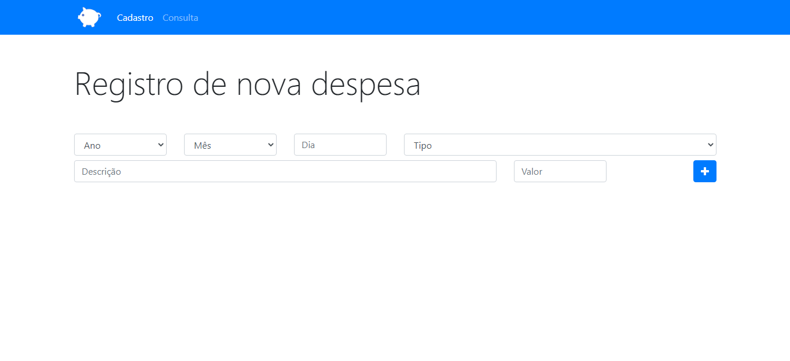
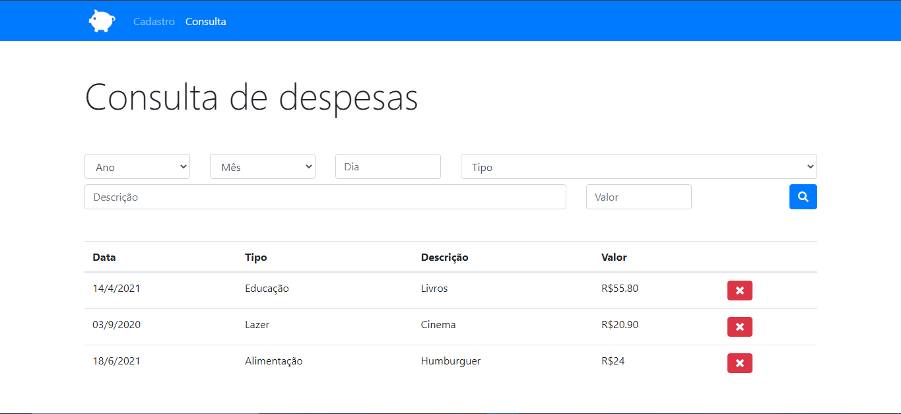

<h1 align="center">App Orçamento Pessoal 📃</h1>

## Sobre o desenvolvimento 🔍
Projeto feito para fins didáticos e prática da linguagem JavaScript. O desenvolvimento desse projeto foi feito usando as tecnologias:

### Tecnologias: <h3> 
* HTML
* CSS - Criação de estilos e costumizações.

### Linguagem de programação: <h3>
* JavaScript - Programar o jogo atráves de scripts externos.

### Frameworks: <h3>
* Bootstrap - Utilização da ferramenta Grid para criação de layouts responsivos, customização de botões e inputs atráves das classes nátivas do Bootstrap em algumas páginas principais. 

>Observações: O foco deste projeto foi o treinamento e prática da linguagem JavaScript. Por isso a escolha de utilizar estilos basicos e classes nativas do Bootstrap para a criação de alguns elementos da página, pois o foco do projeto está em sua lógica de programação.

## Sobre o App 💻

O App é feito para a organização de despesas pessoais, anotando-as e automaticamente sendo armazenadas no banco de dados (localStorage). O App conta com algumas opções que melhoram a experiencia do usuário em relação a organização de suas despesas, contando com uma página onde o usuário poderá pesquisar e achar facilmente registro de anos, valores, tipos e descrições diferentes, está página também conta com a opção de excluir despesas, facilitando a maneira de como percorrer por seus registros.

A sua interface é apresentada de uma maneira simples pôrem dinamica e de boa visualização, para que seja de facil absorção para com os usuários.

## Previews

    
    

